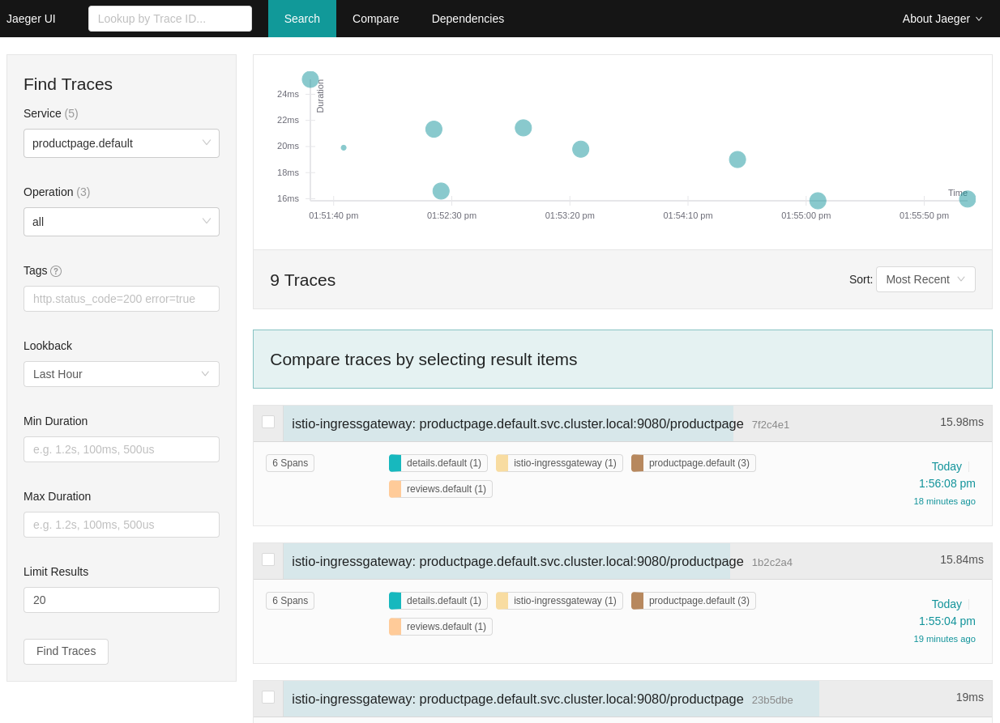

# Istio - Bookinfo Application

Deploy the demo of [Bookinfo](https://istio.io/docs/examples/bookinfo/) application:

```bash
# kubectl apply -f <(istioctl kube-inject -f samples/bookinfo/platform/kube/bookinfo.yaml)
kubectl apply -f samples/bookinfo/platform/kube/bookinfo.yaml
tail -40 samples/bookinfo/platform/kube/bookinfo.yaml
```

Output:

```shell
---
##################################################################################################
# Productpage services
##################################################################################################
apiVersion: v1
kind: Service
metadata:
  name: productpage
  labels:
    app: productpage
    service: productpage
spec:
  ports:
  - port: 9080
    name: http
  selector:
    app: productpage
---
apiVersion: extensions/v1beta1
kind: Deployment
metadata:
  name: productpage-v1
  labels:
    app: productpage
    version: v1
spec:
  replicas: 1
  template:
    metadata:
      labels:
        app: productpage
        version: v1
    spec:
      containers:
      - name: productpage
        image: istio/examples-bookinfo-productpage-v1:1.10.1
        imagePullPolicy: IfNotPresent
        ports:
        - containerPort: 9080
---
```

Example with `istioctl`:

```bash
istioctl kube-inject -f samples/bookinfo/platform/kube/bookinfo.yaml | tail -180
sleep 400
```

Output:

```shell
...
apiVersion: extensions/v1beta1
kind: Deployment
metadata:
  creationTimestamp: null
  labels:
    app: productpage
    version: v1
  name: productpage-v1
spec:
  replicas: 1
  strategy: {}
  template:
    metadata:
      annotations:
        sidecar.istio.io/status: '{"version":"1d03c7b8369fddca69b40289a75eabb02e48b68ad5516e6975265f215d382f74","initContainers":["istio-init"],"containers":["istio-proxy"],"volumes":["istio-envoy","istio-certs"],"imagePullSecrets":null}'
      creationTimestamp: null
      labels:
        app: productpage
        version: v1
    spec:
      containers:
      - image: istio/examples-bookinfo-productpage-v1:1.10.1
        imagePullPolicy: IfNotPresent
        name: productpage
        ports:
        - containerPort: 9080
        resources: {}
...
        image: docker.io/istio/proxyv2:1.1.0
        imagePullPolicy: IfNotPresent
        name: istio-proxy
        ports:
        - containerPort: 15090
          name: http-envoy-prom
          protocol: TCP
```

The Bookinfo application is broken into four separate microservices:

* `productpage` - the productpage microservice calls the details and reviews
  microservices to populate the page.
* `details` - the details microservice contains book information.
* `reviews` - the reviews microservice contains book reviews. It also calls
  the ratings microservice.
* `ratings` - the ratings microservice contains book ranking information
  that accompanies a book review.

There are 3 versions of the `reviews` microservice:

* Version `v1` - doesn't call the **ratings service**.

  

* Version `v2` - calls the ratings service, and displays each rating as 1 to 5
  **black stars**.

  

* Version `v3` - calls the ratings service, and displays each rating as 1 to 5
  **red stars**.

  

[Bookinfo](https://istio.io/docs/examples/bookinfo/) application architecture:


Confirm all services and pods are correctly defined and running:

```bash
kubectl get svc,deployment,pods -o wide
```

Output:

```shell
NAME                  TYPE        CLUSTER-IP       EXTERNAL-IP   PORT(S)    AGE   SELECTOR
service/details       ClusterIP   10.100.84.225    <none>        9080/TCP   2m    app=details
service/kubernetes    ClusterIP   10.100.0.1       <none>        443/TCP    21m   <none>
service/productpage   ClusterIP   10.100.111.89    <none>        9080/TCP   2m    app=productpage
service/ratings       ClusterIP   10.100.217.110   <none>        9080/TCP   2m    app=ratings
service/reviews       ClusterIP   10.100.83.162    <none>        9080/TCP   2m    app=reviews

NAME                                   DESIRED   CURRENT   UP-TO-DATE   AVAILABLE   AGE   CONTAINERS    IMAGES                                          SELECTOR
deployment.extensions/details-v1       1         1         1            1           2m    details       istio/examples-bookinfo-details-v1:1.10.1       app=details,version=v1
deployment.extensions/productpage-v1   1         1         1            1           2m    productpage   istio/examples-bookinfo-productpage-v1:1.10.1   app=productpage,version=v1
deployment.extensions/ratings-v1       1         1         1            1           2m    ratings       istio/examples-bookinfo-ratings-v1:1.10.1       app=ratings,version=v1
deployment.extensions/reviews-v1       1         1         1            1           2m    reviews       istio/examples-bookinfo-reviews-v1:1.10.1       app=reviews,version=v1
deployment.extensions/reviews-v2       1         1         1            1           2m    reviews       istio/examples-bookinfo-reviews-v2:1.10.1       app=reviews,version=v2
deployment.extensions/reviews-v3       1         1         1            1           2m    reviews       istio/examples-bookinfo-reviews-v3:1.10.1       app=reviews,version=v3

NAME                                  READY   STATUS    RESTARTS   AGE   IP               NODE                                              NOMINATED NODE
pod/details-v1-68868454f5-sphh7       2/2     Running   0          2m    192.168.13.128   ip-192-168-26-217.eu-central-1.compute.internal   <none>
pod/productpage-v1-5cb458d74f-wwcqc   2/2     Running   0          2m    192.168.76.160   ip-192-168-69-19.eu-central-1.compute.internal    <none>
pod/ratings-v1-76f4c9765f-lzgpb       2/2     Running   0          2m    192.168.91.69    ip-192-168-69-19.eu-central-1.compute.internal    <none>
pod/reviews-v1-56f6855586-rnkjj       2/2     Running   0          2m    192.168.77.69    ip-192-168-69-19.eu-central-1.compute.internal    <none>
pod/reviews-v2-65c9df47f8-sq2vh       2/2     Running   0          2m    192.168.8.68     ip-192-168-26-217.eu-central-1.compute.internal   <none>
pod/reviews-v3-6cf47594fd-nw8hv       2/2     Running   0          2m    192.168.6.236    ip-192-168-26-217.eu-central-1.compute.internal   <none>
```

Check the container details - you should see also container `istio-proxy` next
to `productpage` container.

```bash
kubectl describe pod -l app=productpage
```

Output:

```yaml
...
Containers:
  productpage:
    Container ID:   docker://62984fbf7913e8cd91e5188571c7efad781880966a0d9b36279f368ad9cbf2a0
    Image:          istio/examples-bookinfo-productpage-v1:1.10.1
...
  istio-proxy:
    Container ID:  docker://17a2c6c87b1e8f315417b284973452332ea34162543af46776075ad1f43db327
    Image:         docker.io/istio/proxyv2:1.1.0
...
```

The `kubectl logs` command will show you the output of the envoy proxy
(`istio-proxy`):

```bash
kubectl logs $(kubectl get pod -l app=productpage -o jsonpath="{.items[0].metadata.name}") istio-proxy | head -70
```

Output:

```shell
...
2019-03-29T09:49:07.660863Z     info    Effective config: binaryPath: /usr/local/bin/envoy
concurrency: 2
configPath: /etc/istio/proxy
connectTimeout: 10s
discoveryAddress: istio-pilot.istio-system:15010
drainDuration: 45s
parentShutdownDuration: 60s
proxyAdminPort: 15000
serviceCluster: productpage.default
statNameLength: 189
tracing:
  zipkin:
    address: zipkin.istio-system:9411

2019-03-29T09:49:07.660886Z     info    Monitored certs: []envoy.CertSource{envoy.CertSource{Directory:"/etc/certs/", Files:[]string{"cert-chain.pem", "key.pem", "root-cert.pem"}}}
2019-03-29T09:49:07.660896Z     info    PilotSAN []string(nil)
2019-03-29T09:49:07.660996Z     info    Opening status port 15020

2019-03-29T09:49:07.661159Z     info    Starting proxy agent
2019-03-29T09:49:07.661340Z     info    Received new config, resetting budget
2019-03-29T09:49:07.661349Z     info    Reconciling retry (budget 10)
2019-03-29T09:49:07.661359Z     info    Epoch 0 starting
2019-03-29T09:49:07.662335Z     info    Envoy command: [-c /etc/istio/proxy/envoy-rev0.json --restart-epoch 0 --drain-time-s 45 --parent-shutdown-time-s 60 --service-cluster productpage.default --service-node sidecar~192.168.76.160~productpage-v1-5cb458d74f-wwcqc.default~default.svc.cluster.local --max-obj-name-len 189 --allow-unknown-fields -l warning --concurrency 2]
...
```

Define the [Istio gateway](https://istio.io/docs/reference/config/istio.networking.v1alpha3/#Gateway)
for the application:

```bash
cat samples/bookinfo/networking/bookinfo-gateway.yaml
kubectl apply -f samples/bookinfo/networking/bookinfo-gateway.yaml
sleep 5
```

Output:

```yaml
apiVersion: networking.istio.io/v1alpha3
kind: Gateway
metadata:
  name: bookinfo-gateway
spec:
  selector:
    istio: ingressgateway # use istio default controller
  servers:
  - port:
      number: 80
      name: http
      protocol: HTTP
    hosts:
    - "*"
---
apiVersion: networking.istio.io/v1alpha3
kind: VirtualService
metadata:
  name: bookinfo
spec:
  hosts:
  - "*"
  gateways:
  - bookinfo-gateway
  http:
  - match:
    - uri:
        exact: /productpage
    - uri:
        exact: /login
    - uri:
        exact: /logout
    - uri:
        prefix: /api/v1/products
    route:
    - destination:
        host: productpage
        port:
          number: 9080
```

Create and display default [destination rules](https://istio.io/docs/reference/config/istio.networking.v1alpha3/#DestinationRule)
(subsets) for the Bookinfo services:

```bash
kubectl apply -f samples/bookinfo/networking/destination-rule-all.yaml
kubectl get destinationrules -o yaml
```

Display the destination rules:

Output:

```yaml
...
- apiVersion: networking.istio.io/v1alpha3
  kind: DestinationRule
...
    name: reviews
    namespace: default
...
  spec:
    host: reviews
    subsets:
    - labels:
        version: v1
      name: v1
    - labels:
        version: v2
      name: v2
    - labels:
        version: v3
      name: v3
...
```

Confirm the gateway and virtualsevice has been created:

```bash
kubectl get gateway,virtualservice,destinationrule
```

Output:

```shell
NAME                                           AGE
gateway.networking.istio.io/bookinfo-gateway   13s

NAME                                          GATEWAYS             HOSTS   AGE
virtualservice.networking.istio.io/bookinfo   [bookinfo-gateway]   [*]     13s

NAME                                              HOST          AGE
destinationrule.networking.istio.io/details       details       8s
destinationrule.networking.istio.io/productpage   productpage   8s
destinationrule.networking.istio.io/ratings       ratings       8s
destinationrule.networking.istio.io/reviews       reviews       8s
```


Check the SSL certificate:

```bash
echo | openssl s_client -showcerts -connect ${MY_DOMAIN}:443 2>/dev/null | openssl x509 -inform pem -noout -text
```

Output:

```shell
Certificate:
    Data:
        Version: 3 (0x2)
        Serial Number:
            03:ba:eb:a2:34:43:0c:ae:7b:63:64:4d:4a:ee:c1:25:b4:35
    Signature Algorithm: sha256WithRSAEncryption
        Issuer: C = US, O = Let's Encrypt, CN = Let's Encrypt Authority X3
        Validity
            Not Before: Mar 29 08:46:52 2019 GMT
            Not After : Jun 27 08:46:52 2019 GMT
        Subject: CN = *.mylabs.dev
        Subject Public Key Info:
            Public Key Algorithm: rsaEncryption
                Public-Key: (2048 bit)
                Modulus:
...
        X509v3 extensions:
            X509v3 Key Usage: critical
                Digital Signature, Key Encipherment
            X509v3 Extended Key Usage:
                TLS Web Server Authentication, TLS Web Client Authentication
            X509v3 Basic Constraints: critical
                CA:FALSE
            X509v3 Subject Key Identifier:
                AB:60:E9:ED:3F:40:72:83:7D:62:08:F9:EB:8F:EA:1C:42:CC:76:4E
            X509v3 Authority Key Identifier:
                keyid:A8:4A:6A:63:04:7D:DD:BA:E6:D1:39:B7:A6:45:65:EF:F3:A8:EC:A1

            Authority Information Access:
                OCSP - URI:http://ocsp.int-x3.letsencrypt.org
                CA Issuers - URI:http://cert.int-x3.letsencrypt.org/

            X509v3 Subject Alternative Name:
                DNS:*.mylabs.dev, DNS:mylabs.dev
            X509v3 Certificate Policies:
                Policy: 2.23.140.1.2.1
                Policy: 1.3.6.1.4.1.44947.1.1.1
                  CPS: http://cps.letsencrypt.org
...
```

You can see it in the certificate transparency log: [https://crt.sh/?q=mylabs.dev](https://crt.sh/?q=mylabs.dev))


SSL Certificate in Kiali [https://kiali.mylabs.dev](https://kiali.mylabs.dev)
web page:


You can also use the [cert-manager](https://github.com/jetstack/cert-manager)
directly to see the status of the certificate:

```bash
kubectl describe certificates ingress-cert-${LETSENCRYPT_ENVIRONMENT} -n istio-system
```

Output:

```text
Name:         ingress-cert-production
Namespace:    istio-system
Labels:       <none>
Annotations:  kubectl.kubernetes.io/last-applied-configuration:
                {"apiVersion":"certmanager.k8s.io/v1alpha1","kind":"Certificate","metadata":{"annotations":{},"name":"ingress-cert-production","namespace"...
API Version:  certmanager.k8s.io/v1alpha1
Kind:         Certificate
Metadata:
  Creation Timestamp:  2019-03-29T09:43:02Z
  Generation:          1
  Resource Version:    2854
  Self Link:           /apis/certmanager.k8s.io/v1alpha1/namespaces/istio-system/certificates/ingress-cert-production
  UID:                 0b677790-5207-11e9-ac06-02dc9c152bfa
Spec:
  Acme:
    Config:
      Dns 01:
        Provider:  aws-route53
      Domains:
        *.mylabs.dev
        mylabs.dev
  Common Name:  *.mylabs.dev
  Dns Names:
    *.mylabs.dev
    mylabs.dev
  Issuer Ref:
    Kind:       ClusterIssuer
    Name:       letsencrypt-production-dns
  Secret Name:  ingress-cert-production
Status:
  Conditions:
    Last Transition Time:  2019-03-29T09:46:53Z
    Message:               Certificate is up to date and has not expired
    Reason:                Ready
    Status:                True
    Type:                  Ready
  Not After:               2019-06-27T08:46:52Z
Events:
  Type     Reason          Age                  From          Message
  ----     ------          ----                 ----          -------
  Warning  IssuerNotReady  9m9s (x2 over 9m9s)  cert-manager  Issuer letsencrypt-production-dns not ready
  Normal   Generated       9m8s                 cert-manager  Generated new private key
  Normal   OrderCreated    9m8s                 cert-manager  Created Order resource "ingress-cert-production-3383842614"
  Normal   OrderComplete   5m18s                cert-manager  Order "ingress-cert-production-3383842614" completed successfully
  Normal   CertIssued      5m18s                cert-manager  Certificate issued successfully
```


Confirm the app is running:

```bash
curl -o /dev/null -s -w "%{http_code}" http://${MY_DOMAIN}/productpage; echo
```

Output:

```shell
200
```

Generate some traffic for next 5 minutes to gather some data for monitoring:

```bash
siege --log=/tmp/siege --concurrent=1 -q --internet --time=10M http://${MY_DOMAIN}/productpage &> /dev/null &
```

In case of DNS issue you can use the services exposed on ports directly from
loadbalancer:

```bash
kubectl -n istio-system get service istio-ingressgateway -o jsonpath="{.status.loadBalancer.ingress[0].hostname}"; echo
```

Output:

```shell
abd0be556520611e9ac0602dc9c152bf-2144127322.eu-central-1.elb.amazonaws.com
```

* Kiali: `http://<IP ADDRESS OF CLUSTER INGRESS>:15029`
* Prometheus: `http://<IP ADDRESS OF CLUSTER INGRESS>:15030`
* Grafana: `http://<IP ADDRESS OF CLUSTER INGRESS>:15031`
* Tracing: `http://<IP ADDRESS OF CLUSTER INGRESS>:15032`

Open the Bookinfo site in your browser [http://mylabs.dev/productpage](http://mylabs.dev/productpage)
and refresh the page several times - you should see different versions
of reviews shown in productpage, presented in a **round robin style**
(red stars, black stars, no stars), since we haven't yet used Istio to control
the version routing.


Check the flows in [Kiali](https://kiali.mylabs.dev/console/graph/namespaces/?edges=requestsPercentOfTotal&graphType=versionedApp&namespaces=default&injectServiceNodes=true&duration=60&pi=5000&layout=dagre):


Open the browser with these pages:

* Servicegraph:

  * [https://servicegraph.mylabs.dev/force/forcegraph.html](https://servicegraph.mylabs.dev/force/forcegraph.html)

    

  * [https://servicegraph.mylabs.dev/dotviz](https://servicegraph.mylabs.dev/dotviz)

    

* [Kiali](https://www.kiali.io/):

  * [https://kiali.mylabs.dev](https://kiali.mylabs.dev) (admin/admin)

    

* [Jaeger](https://www.jaegertracing.io/):

  * [https://jaeger.mylabs.dev](https://jaeger.mylabs.dev)

    

* [Prometheus](https://prometheus.io/):

  * [https://prometheus.mylabs.dev/graph?g0.range_input=1h&g0.expr=istio_requests_total&g0.tab=0](https://prometheus.mylabs.dev/graph?g0.range_input=1h&g0.expr=istio_requests_total&g0.tab=0)

    

  * Total count of all requests to the productpage service:

    * [https://prometheus.mylabs.dev/graph?g0.range_input=1h&g0.expr=istio_requests_total%7Bdestination_service%3D%22productpage.default.svc.cluster.local%22%7D&g0.tab=0](https://prometheus.mylabs.dev/graph?g0.range_input=1h&g0.expr=istio_requests_total%7Bdestination_service%3D%22productpage.default.svc.cluster.local%22%7D&g0.tab=0)

      

  * Total count of all requests to `v1` of the reviews service:

    * [https://prometheus.mylabs.dev/graph?g0.range_input=1h&g0.expr=istio_requests_total%7Bdestination_service%3D%22reviews.default.svc.cluster.local%22%2C%20destination_version%3D%22v1%22%7D&g0.tab=0](https://prometheus.mylabs.dev/graph?g0.range_input=1h&g0.expr=istio_requests_total%7Bdestination_service%3D%22reviews.default.svc.cluster.local%22%2C%20destination_version%3D%22v1%22%7D&g0.tab=0)

      

  * Rate of requests over the past 5 minutes to all instances of the productpage
    service:

    * [https://prometheus.mylabs.dev/graph?g0.range_input=1h&g0.expr=rate(istio_requests_total%7Bdestination_service%3D~%22productpage.*%22%2C%20response_code%3D%22200%22%7D%5B5m%5D)&g0.tab=0](https://prometheus.mylabs.dev/graph?g0.range_input=1h&g0.expr=rate(istio_requests_total%7Bdestination_service%3D~%22productpage.*%22%2C%20response_code%3D%22200%22%7D%5B5m%5D)&g0.tab=0)

      

* [Grafana](https://grafana.com/):

  * [https://grafana.mylabs.dev](https://grafana.mylabs.dev)

  * Grafana -> Home -> Istio ->

    * Istio Performance Dashboard

      

    * Istio Service Dashboard

      

    * Istio Workload Dashboard

      

    * Istio Galley Dashboard

      

    * Istio Mixer Dashboard

      

    * Istio Pilot Dashboard

      


